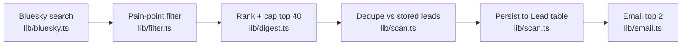
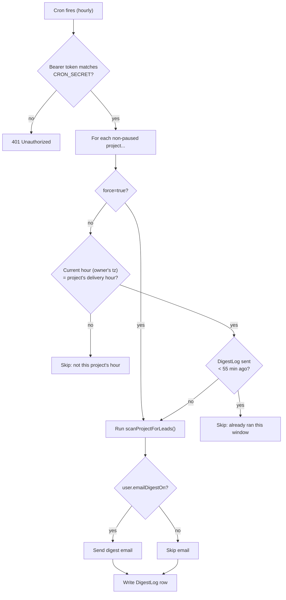

# Architecture: the scan → filter → rank → email pipeline

This doc explains how Pain Scout turns a project's keyword list into a ranked
digest email. It's the internal counterpart to the [README](../README.md)'s
demo-vs-live table — read this when you need to change *how* leads are found,
scored, or delivered, not just whether a feature is wired up.

**TL;DR**: every keyword gets Bluesky-searched, every matching post gets scored
0-100 by `lib/filter.ts`, the top 40 survive as `Lead` rows, and the top 2 of
those go in the digest email. A cron route decides *when* that runs per
project; a manual "Scrape now" button runs the identical pipeline on demand
but never emails.

## Pipeline overview

Every arrow is a function call, not a queue or a separate service — the whole
pipeline runs synchronously inside one request to either of these routes:

| Entry point | Route | Emails? | Logs a `DigestLog`? |
|---|---|---|---|
| Scheduled digest | `POST /api/cron/digest` | Yes, if `user.emailDigestOn` | Yes |
| Manual "Scrape now" | `POST /api/projects/[id]/scan` | Never | No |

Both call the exact same `scanProjectForLeads(project)` in [`lib/scan.ts`](../lib/scan.ts) — there is no separate "manual" code path to drift out of sync with the scheduled one.

## Stage by stage

### 1. Search — `lib/bluesky.ts`

`searchMultipleKeywords(keywords)`:

1. `authenticate()` — logs into Bluesky via `com.atproto.server.createSession` using `BLUESKY_HANDLE` / `BLUESKY_APP_PASSWORD`. The session is cached in-module (`sessionCache`) and reused for ~110 minutes (`TOKEN_TTL_MS`), just under Bluesky's ~2h `accessJwt` expiry, so most calls skip re-auth entirely.
2. Runs `searchPosts(query, accessJwt)` once per keyword against `app.bsky.feed.searchPosts`. On a 401 mid-run, it invalidates the cached session, re-authenticates once, and retries — a single retry, not a loop.
3. Merges results across all keywords, deduping by post `uri` (one post can match more than one keyword).

Output: `BlueskyPost[]` — raw posts, unscored, unfiltered.

### 2. Filter — `lib/filter.ts`

`filterPosts(posts, keywords)` scores each post and drops the ones that don't clear the bar. Rejections, in order:

1. **Age** — anything older than `MAX_POST_AGE_DAYS` (7) is dropped. Bluesky search can surface old posts the first time they match a keyword; that's not a "just happened" signal.
2. **No keyword match** — filtered again here (belt-and-suspenders with the search query itself).
3. **Noise phrases** — `NOISE_PHRASES` (giveaways, hiring posts, memes, self-promo) reject outright.
4. **Pipe-spam heuristic** — bot/spam accounts append pipe-delimited buzzword lists (`"...| Best AI tools...| How to start..."`) to farm keyword matches. More than `MAX_PIPE_SEGMENTS` (2) literal `|` characters is treated as a structural spam tell, since organic writing rarely uses 3+.

Surviving posts get a `score` (capped at 100):

- `+20` per distinct matched keyword
- `+12` per matched `PAIN_PHRASES` entry ("sick of", "looking for an alternative", "wish there was", etc. — phrasing that skews toward a genuine complaint vs. a mention)
- `+5` if the post contains a `?`
- `+8` if the post is over 120 characters (a fuller post beats a one-liner)

Anything scoring below `MIN_SCORE_THRESHOLD` (20) is dropped. In practice this floor rarely triggers on its own — noise/spam is already rejected above — it exists to catch the rare zero-signal edge case. Pain-phrase, question, and length bonuses still matter: they're what determines the *ranking* on real leads, not just pass/fail.

**Worked example** — keywords are `["invoicing", "spreadsheet"]`, and a matching post reads:

> "Anyone know of a good invoicing tool? Sick of wrestling with a spreadsheet every month, it's a total nightmare and I always mess something up."

| Rule | Hit? | Points |
|---|---|---|
| Matched keywords (`invoicing`, `spreadsheet`) | 2 × 20 | +40 |
| Pain phrases (`anyone know of`, `sick of`, `nightmare`) | 3 × 12 | +36 |
| Contains `?` | yes | +5 |
| Over 120 characters | yes | +8 |
| **Total (capped at 100)** | | **89** |

That score is what `rankForDigest` sorts on and what shows up next to the lead on the dashboard and in the email.

**Swapping in an AI classifier**: the module docstring calls this out explicitly — call an LLM inside `scorePost` and blend its confidence into `score` before the threshold check. Everything downstream (ranking, digest, email) reads `ScoredLead.score` and doesn't care how it was computed.

Output: `ScoredLead[]` — `{ post, score, matchedKeywords }`.

### 3. Rank — `lib/digest.ts`

`rankForDigest(leads)` sorts by `score` desc, then `createdAt` desc as a tiebreak, and caps to `MAX_DIGEST_LENGTH` (40). This cap exists so one prolific keyword can't flood a single run — it's a per-scan cap, not a per-email cap (see the email step below for that).

Output: `DigestItem[]` — the shape stored in the `Lead` table and rendered in the email.

### 4. Dedupe + persist — `lib/scan.ts`

`scanProjectForLeads(project)` is the glue that owns the parts of the pipeline that touch the database:

1. Runs search → filter → rank (stages 1-3 above).
2. Queries existing `Lead` rows for this project whose `postUri` is already in the ranked set, and filters those out. This is the dedupe step — `Lead` also has a `@@unique([projectId, postUri])` constraint in [`prisma/schema.prisma`](../prisma/schema.prisma) as a backstop, so a race between two overlapping scans can't double-insert the same post.
3. Bulk-inserts the surviving "fresh" leads via `createMany`.

Output: `DigestItem[]` — only the leads that are new *this run*. This is what the dashboard shows as newly-found and what the cron route hands to the emailer.

### 5. Email — `lib/email.ts` + `components/emails/digest-email.tsx`

`sendDigestEmail()` sends via Resend, using the React Email component `DigestEmail` for the HTML body. Two details worth knowing:

- **The email only gets the top `MAX_EMAIL_LEADS` (2)** leads (sliced in `app/api/cron/digest/route.ts` before calling `sendDigestEmail`), even though `freshLeads` may contain up to 40. The email is a quick daily glance; the dashboard is where you see everything. `totalCount` is passed separately so the subject/body can say "12 new leads" while only showing 2.
- **It always sends, even with zero leads** — the subject line branches to `"No new leads for {project}"` so the owner gets a "we checked and found nothing" confirmation instead of silence that's indistinguishable from a broken cron job.

## Scheduling and gating — `app/api/cron/digest/route.ts`

This route is what an external scheduler (cron-job.org or similar) hits, expected to fire **at least once an hour**. It doesn't send a digest on every fire for every project — the route computes per-project delivery gating itself, running this check for **every non-paused project, on every hourly fire**:

Two details that aren't obvious from the diagram:

- **The Pro-plan check re-runs every time.** `TWICE_DAILY` only opens the second delivery-hour slot if `getUserPlan()` currently returns Pro — checked fresh on each run, not cached from when the project was configured. A project left on `TWICE_DAILY` after a Pro→Free downgrade silently falls back to once-daily without anyone touching project settings.
- **The `DigestLog` write is what the 55-minute guard checks next time.** This is what makes "fire hourly, gate internally" safe against double-sends near an hour boundary, instead of requiring the external scheduler to be precise. A project whose run *fails* before reaching that write is correctly retried on the next hourly fire, since no guard-tripping log exists yet.

`?force=true` (still requires the same bearer auth) skips straight to `G`, bypassing both the delivery-hour and recent-send checks — useful for manually testing the full pipeline without waiting for a project's actual delivery hour.

Per-project failures are caught individually (`try/catch` inside the loop), so one project's Bluesky/Resend error doesn't block the rest of the batch. The route always returns `200` with a `results[]` array describing the outcome — `sent`, `skipped` (with a reason), or `error` — per project.

## Where mock mode diverges

None of the above runs in demo mode. `lib/data/*.ts` functions branch on `isDatabaseConfigured()` (see [`lib/prisma.ts`](../lib/prisma.ts)) and read from [`lib/mock-data.ts`](../lib/mock-data.ts) instead — the dashboard UI never calls `scanProjectForLeads` or `/api/cron/digest` directly either way. See the README's [demo-vs-live table](../README.md#whats-demo-vs-whats-real) for the full breakdown.

## Extension points

| Want to change... | Touch this file | Notes |
|---|---|---|
| What counts as a "pain" post | `lib/filter.ts` | `PAIN_PHRASES`, `NOISE_PHRASES`, scoring weights, or swap in an LLM classifier per the docstring |
| How many leads make the digest | `lib/digest.ts` (`MAX_DIGEST_LENGTH`) / `app/api/cron/digest/route.ts` (`MAX_EMAIL_LEADS`) | Per-scan cap vs. per-email cap are separate constants on purpose |
| Delivery timing rules | `app/api/cron/digest/route.ts` (`deliveryHoursFor`, `RECENT_SEND_GUARD_MS`) | Keep the recent-send guard in sync with your scheduler's actual polling interval |
| Post source (beyond Bluesky) | `lib/bluesky.ts` | `scanProjectForLeads` only depends on `BlueskyPost[]` shape from `searchMultipleKeywords` — swapping the source means matching that return type |
| Email content/layout | `components/emails/digest-email.tsx` | `lib/email.ts` just wires props into it |
